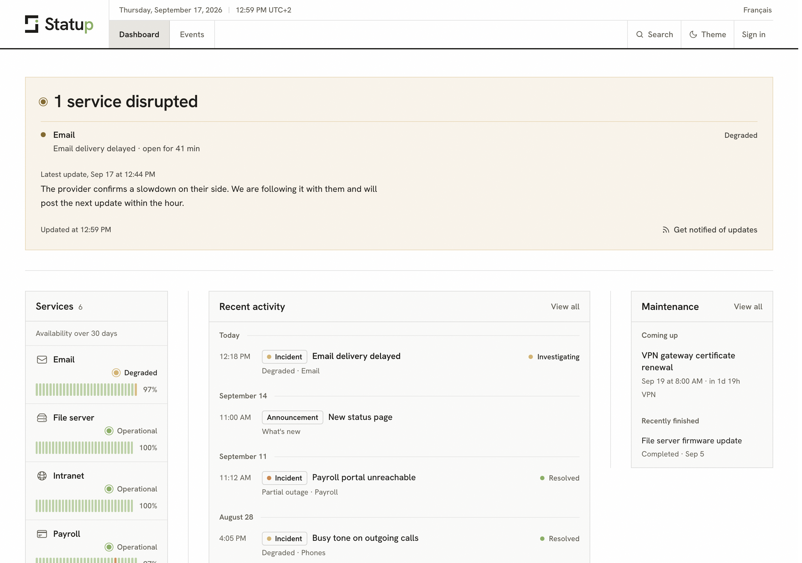

<div align="center">

<picture>
  <source media="(prefers-color-scheme: dark)" srcset="static/logo-dark.svg">
  
</picture>

# Statup

A self-hosted status page for IT teams. One Rust binary and its static files, one SQLite database, no external service.

[](LICENSE)
[](https://www.rust-lang.org/)
[](#status)

</div>

Stop answering "is it down?" at the helpdesk. Statup gives your whole organization one place to check whether the tools work, follow an incident as it unfolds and read about planned maintenance. The IT team publishes; accounting, payroll, HR and everyone else read it in plain words, from a desk or a phone.

<picture>
  <source media="(prefers-color-scheme: dark)" srcset=".github/assets/status-page-dark.png">
  
</picture>

### Status

Statup is **pre-v1**. It is usable and self-hostable, and the interface is being finished before the first stable release. Expect changes between versions, and back up before upgrading.

### Features

- **Status page**: every service with its state (operational, degraded, partial outage, outage, maintenance) and its last 30 days. A banner answers "is something wrong?" first, names what is affected and since when, and the page refreshes itself every minute.
- **Incidents** from investigation to resolution: a severity that sets the state of the services concerned, dated updates in Markdown, reusable templates.
- **Maintenances**, announced ahead with a start and an end (the page switches on its own at those times) or started right away.
- **Announcements** for releases and news that affect nobody's service.
- **Events list** with full-text search over titles and descriptions, filters by type, state, service and dates, and a side panel to read an event without leaving the list.
- **Following updates**: an Atom feed at `/feed` for feed readers and chat tools, with a page that explains how to use it.
- **Roles**: Reader, Editor, Administrator. The page is open to everyone or to members only, and members are added from the Team page.
- **Your instance**: its own name in the header and the browser tab, 24 built-in service icons or your own (PNG, JPEG, WebP or SVG up to 256 KB), the dashboard blocks you choose, in your order.
- **French and English**, light and dark themes, usable with a keyboard and a screen reader, calm with reduced motion.

### Why Statup

- **Small footprint.** Templates, translations and migrations are compiled into the binary. SQLite in WAL mode; no Redis, no Postgres.
- **Secure defaults.** Argon2id password hashing, CSRF tokens on every form, a Content Security Policy that allows the instance's own files only, rate limits on pages and on sign-in, parameterized SQL, sanitized Markdown and SVG. See [SECURITY.md](SECURITY.md) for reporting a problem.
- **Server-rendered.** Askama templates, htmx for the parts that update in place, a few small scripts, no JavaScript framework.
- **Private.** Fonts and scripts are served by the instance: a visitor's browser never calls a third party.

### Quick start

Requirements: Docker with Docker Compose 2.24 or newer.

```bash
git clone https://github.com/karl-cta/statup.git && cd statup
docker compose up -d
```

The first start compiles Statup, which takes a few minutes. Then open http://localhost:3000: an empty instance asks for its administrator account. The first account created is the administrator, so create it before others can reach the instance, or preset it with `ADMIN_EMAIL` and `ADMIN_PASSWORD`.

Set your time zone before going further, for example `TZ=Europe/Paris` in `.env` (see Configuration). The host port is the left side of `ports:` in `docker-compose.yml`.

### Access and roles

| Role | Can |
|---|---|
| Reader | Read the dashboard, the events and the feed, edit their own profile |
| Editor | Everything a reader can, plus publish incidents, maintenances and announcements, set service states, manage services, templates and icons |
| Administrator | Everything, plus the settings, the team, the dashboard blocks, and changing or deleting closed events |

Who can see the page is chosen in **Settings, Public page**:

- **Everyone**: visitors read the page and the feed without an account.
- **Members only**: visitors are asked to sign in, and feed readers can no longer read the feed.

Accounts are created by an administrator on the **Team** page, with a temporary password shown once; the member chooses their own at first sign-in. Self-registration only exists on an empty instance, for its first administrator.

`PUBLIC_MODE` only sets the starting choice: once an administrator picks one in Settings, it is kept across restarts.

### Configuration

Every setting is optional. Copy `.env.example` to `.env` to change one. With Docker Compose, `DATABASE_URL`, `UPLOAD_DIR`, `HOST` and `PORT` belong to the image, so the data stays in its volume.

| Variable | Default | Description |
|---|---|---|
| `TZ` | system zone | Time zone of the instance, e.g. `Europe/Paris`. Dates are shown in it, with the UTC offset where it matters, and maintenance times are typed in it |
| `PUBLIC_URL` | request host | Address visitors use, e.g. `https://status.example.com`. Feed links use it; an `https://` address marks the session cookie `Secure` and sends HSTS |
| `TRUST_PROXY_HEADERS` | `false` | Read the client address from `X-Real-IP`, or the last entry of `X-Forwarded-For` or `Forwarded`, and the scheme from `X-Forwarded-Proto`. Only behind a reverse proxy that sets them |
| `PUBLIC_MODE` | `false` | Starting public access, until an administrator chooses in Settings |
| `DEFAULT_LOCALE` | `fr` | `fr` or `en`, for visitors whose browser asks for neither |
| `ADMIN_EMAIL`, `ADMIN_PASSWORD` | unset | Create an administrator at start when no account exists. Both are needed, and the password needs 12 characters or more. Remove them afterwards |
| `DATABASE_URL` | `./statup.db` | SQLite database file |
| `UPLOAD_DIR` | `data/uploads` | Where uploaded icons are kept |
| `HOST` | `0.0.0.0` | Listen address, an IP address |
| `PORT` | `3000` | Listen port |
| `SESSION_EXPIRY` | `604800` | Seconds a sign-in form stays valid. Once signed in, a session lasts 30 days without a visit with "Stay signed in", 24 hours otherwise |
| `DB_MAX_CONNECTIONS` | `10` | Database pool size |
| `LOG_LEVEL` | `info` | `trace`, `debug`, `info`, `warn`, `error` or `off` |
| `RUST_LOG` | unset | Finer log filter, e.g. `statup=debug,tower_http=info`. Replaces `LOG_LEVEL` when set |

### Running behind a reverse proxy

Terminate TLS at the proxy, publish Statup on loopback only (`"127.0.0.1:3000:3000"` in `docker-compose.yml`), then set:

```bash
PUBLIC_URL=https://status.example.com
TRUST_PROXY_HEADERS=true
```

Statup takes the client address from `X-Real-IP`, otherwise from the last entry of `X-Forwarded-For` or `Forwarded`: the one your proxy wrote, whatever a client sent before it. With nginx:

```nginx
location / {
    proxy_pass http://127.0.0.1:3000;
    proxy_set_header Host $host;
    proxy_set_header X-Real-IP $remote_addr;
    proxy_set_header X-Forwarded-For $proxy_add_x_forwarded_for;
    proxy_set_header X-Forwarded-Proto $scheme;
}
```

Never enable `TRUST_PROXY_HEADERS` when Statup can be reached directly: anyone could then pick their own address and walk around the rate limits.

### Backups

Everything lives in the SQLite database (with its `-wal` and `-shm` files) and the uploads directory. With Docker, both are in the `statup_data` volume, which Compose names after the project folder: `statup_statup_data` for a clone called `statup`.

```bash
docker compose stop statup
docker run --rm -v statup_statup_data:/data -v "$PWD":/backup alpine \
  tar czf /backup/statup-backup.tar.gz -C /data .
docker compose start statup
```

From source, stop the server and copy `statup.db*` and `data/uploads/`.

### Upgrading

```bash
git pull
docker compose up -d --build
```

Database migrations are compiled into the binary and run at start. Back up first: a database migrated by a newer version is refused by an older one.

### Forgotten password

Give the account a temporary password from the server:

```bash
docker compose exec statup /app/statup reset-password you@example.com
# From source, next to your .env: ./target/release/statup reset-password you@example.com
```

Hand it over. The person signs in with it and is asked to choose their own, and any session still open on that account is signed out. Only active accounts can be reset, and the command never creates a database: a mistyped `DATABASE_URL` is reported as such.

### Health check

`GET /health` answers `{"status":"ok"}` with 200, or `{"status":"degraded"}` with 503 when the database does not respond. It is not rate limited and opens no session.

### Development

Requires Rust 1.88 or newer and the [Tailwind CSS standalone CLI](https://github.com/tailwindlabs/tailwindcss/releases) v4.1.18, saved at the repository root as `tailwindcss`.

```bash
./scripts/build-css.sh           # add --watch while editing styles
cargo run                        # http://localhost:3000, from the repository root
cargo test
cargo clippy --all-targets -- -D warnings
cargo fmt
```

The server serves `static/` from its working directory; templates live in `templates/`, translations in `locales/`, migrations in `migrations/`. A release build is `cargo build --release`, run next to a built `static/` directory.

Other scripts: `scripts/build-release.sh` packages a release archive for the host or the given Rust targets, `scripts/coverage.sh` runs the tests under `cargo-llvm-cov`, `scripts/build-icons.py` regenerates the favicons from the logo. Continuous integration runs the format check, clippy, the tests on stable and on Rust 1.88, the dependency advisories, the stylesheet and the Docker build.

### License

Statup is licensed under the [GNU Affero General Public License v3.0 or later](LICENSE). If you run a modified version for others over a network, offer them its source code.

It ships htmx, the Hanken Grotesk font, icons from Heroicons and the base styles of Tailwind CSS, under their own licenses: see [THIRD_PARTY_NOTICES.md](THIRD_PARTY_NOTICES.md).
