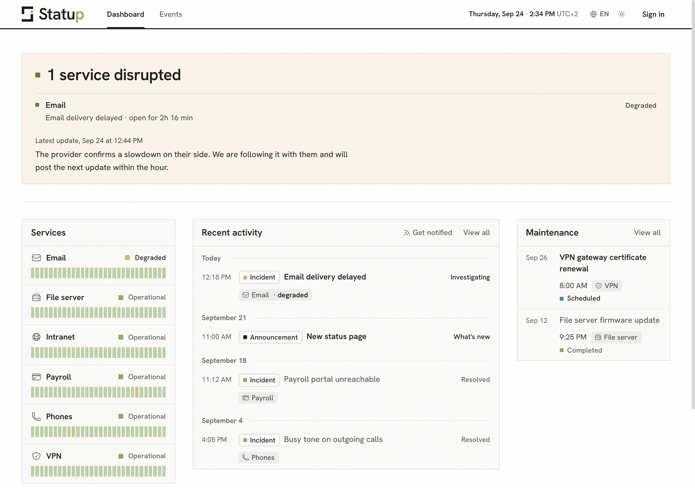
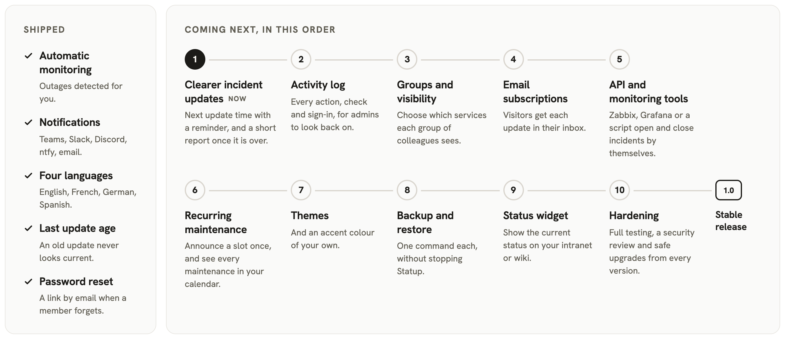

<div align="center">

<picture>
  <source media="(prefers-color-scheme: dark)" srcset=".github/assets/wordmark-dark.svg">
  
</picture>

### Every team in the loop, before anyone asks.

[](LICENSE)
[](https://www.rust-lang.org/)
[](#status)

[Live demo](https://demo.statup.dev) · [Website](https://statup.dev) · [Quick start](#quick-start) · [Self-hosting guide](.github/SELF-HOSTING.md)

</div>

<br>

<picture>
  <source media="(prefers-color-scheme: dark)" srcset=".github/assets/status-page-dark.png">
  
</picture>

## What is Statup?

> *"Is the internet down?"* *"Is it just me, or is Outlook broken?"*

Every outage starts with the same questions, by phone, by chat and at the IT office door. Statup answers them before anyone asks.

It is a status page you host yourself. Whoever runs a service posts, once, what is broken, what is planned and what has changed. Everyone else reads it in plain words, from a desk or a phone, without an account. Monitoring tools are made for the people who fix things; Statup is made for everyone else.

**What it is for**

- **An outage**: the VPN is down. The whole company sees it, sees that IT is on it, and sees when it is back.
- **Planned work**: the accounting software upgrade is announced a week ahead, then starts and ends on its own on Saturday.
- **News**: a new version of the payroll software, the printer that moved to the second floor, the VPN client everyone must install.
- **Beyond IT**: a small business keeping its clients informed when its service is down.

**[Try the live demo](https://demo.statup.dev)**, and sign in with `demo@statup.dev` / `StatupDemo#1` to publish as an editor. It starts over every hour.

## Features

- **The answer first**: a banner says what is wrong, what is affected and since when, above every service and its last 30 days.
- **Runs on its own**: a service follows the incident that names it, and planned work starts and ends at the times announced.
- **Notices first**: every minute, Statup checks that a site or a server answers, and shows an outage after three failed checks.
- **Quick to publish**: dated updates and reusable templates; an outage spotted by the checks is declared in one click.
- **Tells people where they are**: each incident, maintenance and announcement posted to Microsoft Teams, Slack, Google Chat, Discord or Mattermost, to phones through ntfy, by email, or to any tool through a webhook, in the language of each destination.
- **Easy to follow**: search and filters, a side panel to read without leaving the list, and an Atom feed for feed readers.
- **Your page, your way**: public or members only, your name and logo, blocks you arrange on the page; French, English, German and Spanish, light and dark, accessible.

**Light, private, safe by default.**

- **Light**: one Rust binary and one SQLite file, in a Docker image of about 11 MB. No Redis, no Postgres.
- **Private**: fonts and scripts come from your instance. The server only reaches the addresses you ask it to check or to notify, and GitHub once a day to look for a new version (`UPDATE_CHECK=false` turns that off).
- **Safe**: passwords hashed with Argon2id, a CSRF token on every form, a strict Content Security Policy on every page.

## How it works

- **Services** are the tools people rely on: mail, the VPN, the ERP, the phones. Each shows one state: operational, degraded, outage or maintenance. Statup can also check on its own that a service answers.
- **Events** are what gets published. An **incident** when something breaks, a **maintenance** when work is planned, an **announcement** for news. An incident or a maintenance sets the state of the services it names until it ends.
- **People** read the page, with or without an account. **Editors** publish events and set service states; **administrators** also run the settings, the team and the layout of the page.

## Quick start

You need Docker with Docker Compose 2.24 or newer.

**1. Start Statup**

```bash
mkdir statup && cd statup
curl -O https://raw.githubusercontent.com/karl-cta/statup/main/docker-compose.yml
docker compose up -d
```

Docker downloads the ready image, for x86-64 and ARM servers alike, and starts it in seconds.

**2. Open it in your browser**

At http://localhost:3000, or your server's address on port 3000, an empty instance walks you through four steps: your administrator account, the page's name, logo and audience, the services to follow, then the address to share.

**3. Invite your team**

Add them from the **Team** page: they open the same address. For HTTPS and a name of your own, such as `status.example.com`, put Statup behind a reverse proxy.

> [!TIP]
> The [self-hosting guide](.github/SELF-HOSTING.md) has the rest: every setting, a reverse proxy with nginx or Caddy, backups, upgrades and a forgotten password.

## Roadmap

<picture>
  <source media="(prefers-color-scheme: dark)" srcset=".github/assets/roadmap-dark.png">
  
</picture>

Planned, in this order, without dates:

1. **Clearer incident updates**: time since the last update, next update time with a reminder, and a short report once it is over.
2. **Activity log**: every action, check and sign-in, for administrators to look back on.
3. **Groups and visibility**: choose which services and events each group of colleagues sees.
4. **Email subscriptions**: visitors get each update in their inbox.
5. **API and monitoring tools**: Zabbix, Grafana or a script open and close incidents by themselves.
6. **Recurring maintenance**: announce a slot once, and see every maintenance in your calendar.
7. **Themes** and an accent colour.
8. **Backup and restore**, one command each, without stopping Statup.
9. **Status widget** for your intranet or wiki.
10. **Hardening**: full testing, a security review and safe upgrades from every version, before 1.0.

Ideas and requests are welcome in the [issues](https://github.com/karl-cta/statup/issues).

## Status

Statup is **pre-v1**: usable and self-hostable, with the interface being finished before the first stable release. Expect changes between versions and back up before upgrading. Every change is in the [changelog](.github/CHANGELOG.md).

Statup is not related to Statping, a Go project first published under the name Statup.

## Contributing

Built with Rust, Axum, SQLite, Askama templates and htmx. The [contributing guide](.github/CONTRIBUTING.md) explains how to build Statup, where things are in the code, and the checks a change must pass.

## License

Statup is licensed under the [GNU Affero General Public License v3.0 or later](LICENSE). If you run a modified version for others over a network, offer them its source code.

It ships htmx, the Hanken Grotesk font, icons from Heroicons and the base styles of Tailwind CSS, under their own licenses: see [THIRD_PARTY_NOTICES.md](THIRD_PARTY_NOTICES.md).
